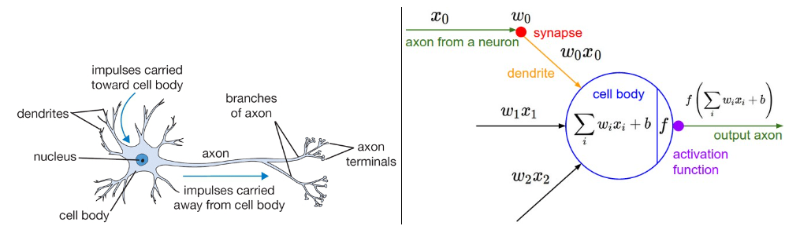

# 1. Introduction

## What are Neural Networks?

A neural network is an Artificial Intelligence method that teaches computers how to perform some task by analyzing training examples given to them in a way inspired by the human brain.

So since neural networks were inspired by the brain, what about a quick look at our brain.

<figure><figcaption>
A biological neuron (left) and its mathematical model (right)
</figcaption></figure>
